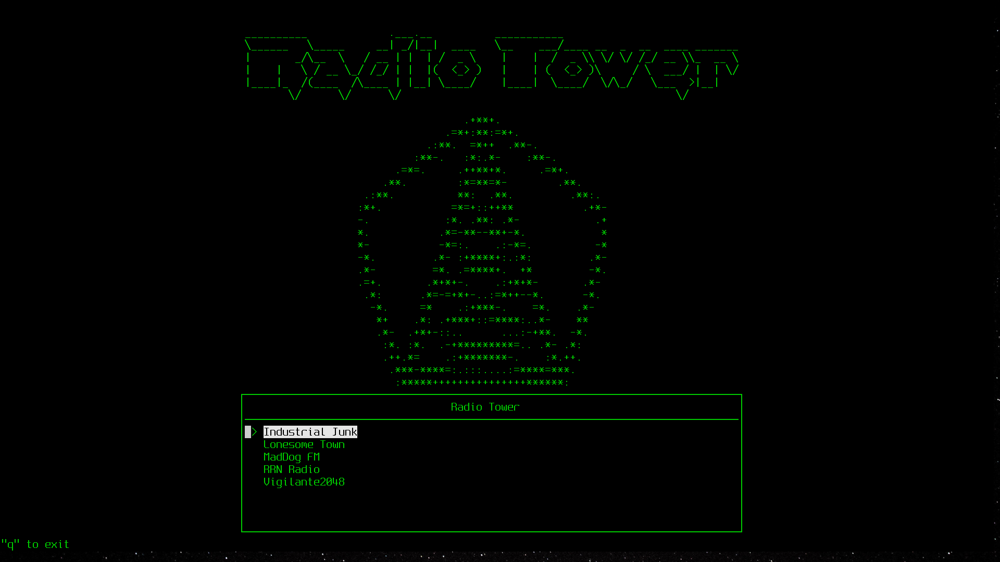
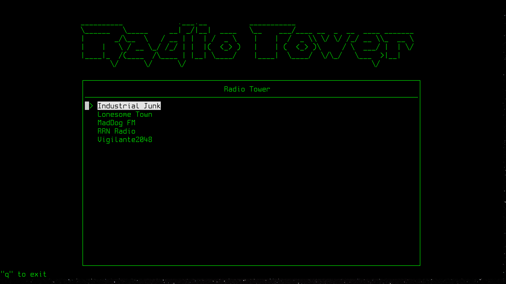
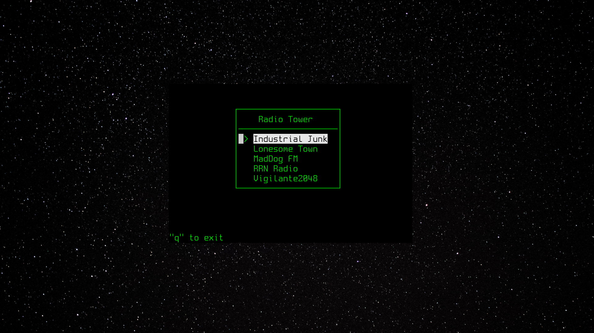

## Радиовышка для терминала *nix
### Версия альфа 0.0.1




По сути это приложение - просто TUI для mpg123 - проигрывателя, способного играть радио icecast, как на нашей любимой радиовышке [radiotower.su](http://radiotower.su), только локально.

Работает на любой системе, на которую можно установить зависимости:

### Зависимости
- ncurses
- mpg123
- make*

> * make на самом деле не обязателен, т. к. сборка проста до боли. Можете собрать без него с `cc -o raditower -lmenu -lncurses`

### Сборка и установка
```
make
make install
```

### Скрипт, открывающий радиовышку в отдельном терминале 
Он находится среди файлов - [rtopen.sh](./rtopen.sh). Можно скопировать его куда пожелаете, а можно `make script`, чтобы установить его в /bin
